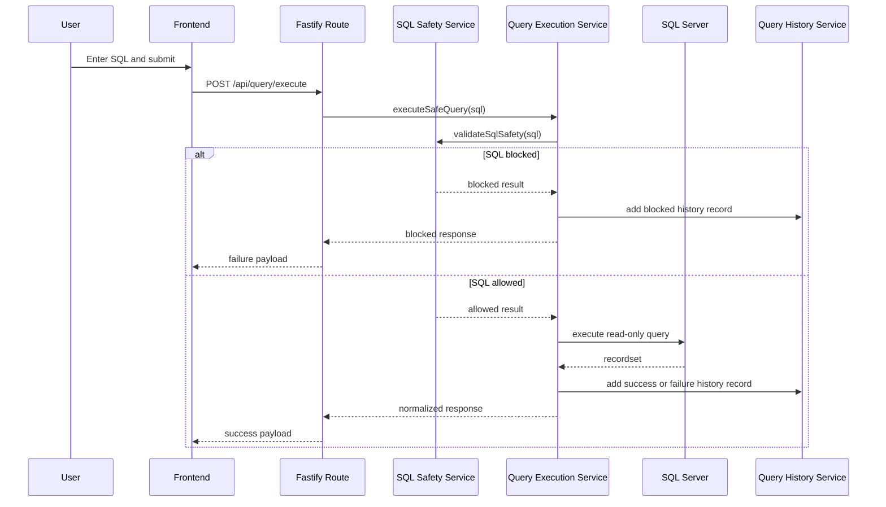

# Query Execution Sequence Diagram

```mermaid
sequenceDiagram
    participant U as User
    participant F as Frontend
    participant R as Fastify Route
    participant S as SQL Safety Service
    participant E as Query Execution Service
    participant D as SQL Server
    participant H as Query History Service

    U->>F: Enter SQL and submit
    F->>R: POST /api/query/execute
    R->>E: executeSafeQuery(sql)
    E->>S: validateSqlSafety(sql)

    alt SQL blocked
        S-->>E: blocked result
        E->>H: add blocked history record
        E-->>R: blocked response
        R-->>F: failure payload
    else SQL allowed
        S-->>E: allowed result
        E->>D: execute read-only query
        D-->>E: recordset
        E->>H: add success or failure history record
        E-->>R: normalized response
        R-->>F: success payload
    end
```
