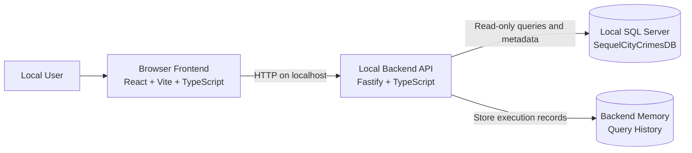

# System Context Diagram

```mermaid
flowchart LR
    User[Local User]
    Browser[Browser Frontend<br/>React + Vite + TypeScript]
    Api[Local Backend API<br/>Fastify + TypeScript]
    Db[(Local SQL Server<br/>SequelCityCrimesDB)]
    Memory[(Backend Memory<br/>Query History)]

    User --> Browser
    Browser -->|HTTP on localhost| Api
    Api -->|Read-only queries and metadata| Db
    Api -->|Store execution records| Memory
```
