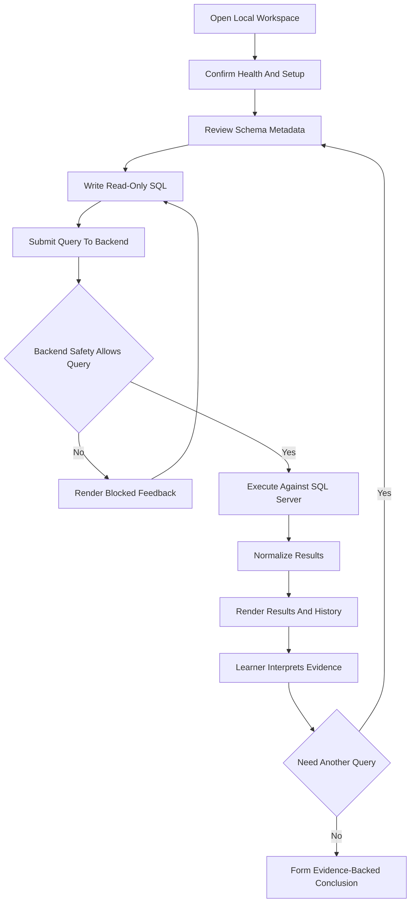

# Investigation Flow Diagram

```mermaid
flowchart TD
    A[Open Local Workspace] --> B[Confirm Health And Setup]
    B --> C[Review Schema Metadata]
    C --> D[Write Read-Only SQL]
    D --> E[Submit Query To Backend]
    E --> F{Backend Safety Allows Query}
    F -- No --> G[Render Blocked Feedback]
    G --> D
    F -- Yes --> H[Execute Against SQL Server]
    H --> I[Normalize Results]
    I --> J[Render Results And History]
    J --> K[Learner Interprets Evidence]
    K --> L{Need Another Query}
    L -- Yes --> C
    L -- No --> M[Form Evidence-Backed Conclusion]
```
