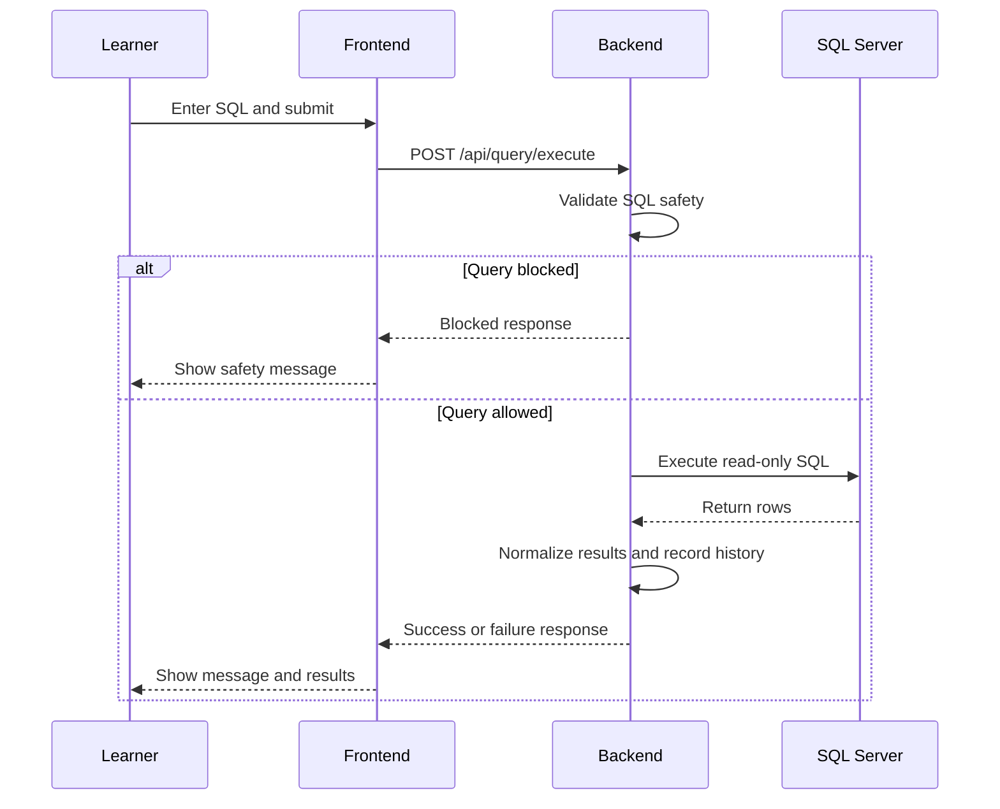

# Query Feedback Sequence Diagram

```mermaid
sequenceDiagram
    participant L as Learner
    participant F as Frontend
    participant B as Backend
    participant D as SQL Server

    L->>F: Enter SQL and submit
    F->>B: POST /api/query/execute
    B->>B: Validate SQL safety
    alt Query blocked
        B-->>F: Blocked response
        F-->>L: Show safety message
    else Query allowed
        B->>D: Execute read-only SQL
        D-->>B: Return rows
        B->>B: Normalize results and record history
        B-->>F: Success or failure response
        F-->>L: Show message and results
    end
```
