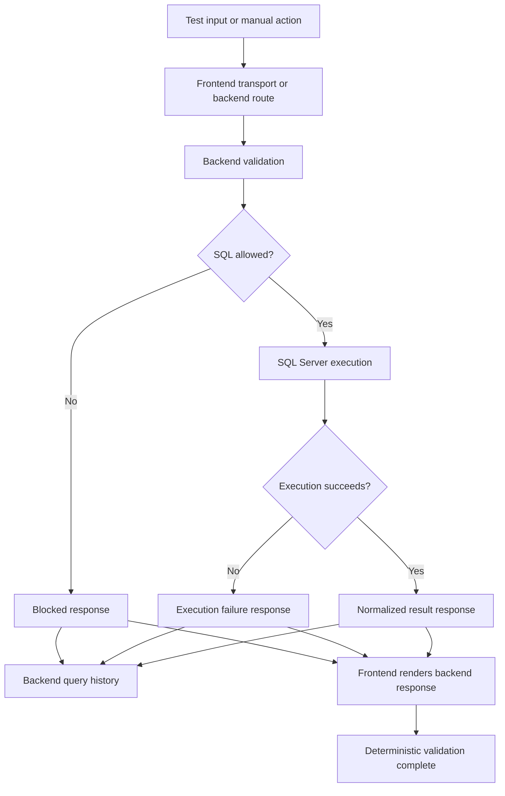

# Testing Flow Diagram

```mermaid
flowchart TD
  A["Test input or manual action"] --> B["Frontend transport or backend route"]
  B --> C["Backend validation"]
  C --> D{"SQL allowed?"}
  D -->|No| E["Blocked response"]
  D -->|Yes| F["SQL Server execution"]
  F --> G{"Execution succeeds?"}
  G -->|No| H["Execution failure response"]
  G -->|Yes| I["Normalized result response"]
  E --> J["Backend query history"]
  H --> J
  I --> J
  E --> K["Frontend renders backend response"]
  H --> K
  I --> K
  K --> L["Deterministic validation complete"]
```
